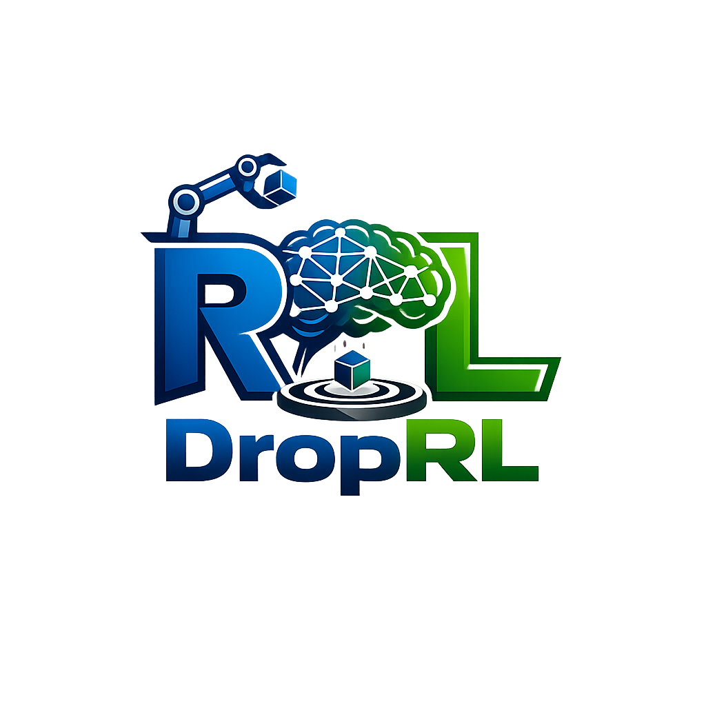

<p align="center">
  
</p>

<p align="center"><strong>Drop an environment folder. Pick an algorithm. Ship it.</strong></p>

<p align="center">
  <a href="https://github.com/alhussein-jamil/droprl/actions/workflows/ci.yml"></a>
  <a href="https://www.python.org/downloads/"></a>
  <a href="LICENSE"></a>
  <a href="https://docs.ray.io/en/latest/rllib/index.html"></a>
</p>

DropRL is a minimal, env-first reinforcement learning framework built on [Ray RLlib](https://docs.ray.io/en/latest/rllib/index.html). Add a task under `envs/<name>/`, set `algorithm` in YAML, and go — no boilerplate projects, no per-env Makefiles.

Includes a **mock** env for fast iteration, **cartpole** (Gymnasium `CartPole-v1`) for integration testing, **pendulum** (Gymnasium `Pendulum-v1`) as a SAC example, and a full **Cassie** locomotion task (MuJoCo).

## Why DropRL?

| | DropRL | Typical RL repo |
|---|---|---|
| Add a new task | Copy `envs/_template/` | Fork, refactor, wire callbacks |
| Resume training | `make train` | Custom checkpoint scripts |
| Render best policy | `make render` | Manual checkpoint paths |
| Config | YAML merge: global → env → train | Scattered Python constants |
| Swap algorithm | Change `algorithm:` in train YAML | Fork training scripts |

## Quick start

Requires **Python 3.10–3.12** (Ray 2.44.1).

```bash
git clone https://github.com/alhussein-jamil/droprl.git
cd droprl
make install
make train TASK=mock ITERS=5
make train TASK=cartpole ITERS=20    # Gymnasium CartPole-v1 (PPO)
make train TASK=cartpole TRAIN=CartpoleDQN ITERS=100   # DQN example
make train TASK=pendulum TRAIN=PendulumSAC ITERS=200   # SAC example
make tensorboard
```

## Layout

```
DropRL/
├── configs/
│   ├── config.yaml              # global defaults (ray, run, lr_schedule)
│   └── train/<Task>.yaml        # algorithm + RLlib hyperparameters
├── envs/
│   ├── _template/               # copy to scaffold a new task
│   └── <task>/
│       ├── env.py               # ENV_ID + make_env(config)
│       ├── config.yaml          # task parameters
│       ├── callbacks.py         # optional RLlib hooks (auto-discovered)
│       ├── requirements.txt     # optional extra deps
│       └── assets/              # optional meshes, models
├── scripts/
│   ├── train.py
│   └── render.py
└── src/droprl/
```

Config merge order: `configs/config.yaml` → `envs/<task>/config.yaml` → `configs/train/<Train>.yaml`.

## Commands

```bash
make install                         # venv + core deps (from pyproject.toml)
make install-dev                     # + lint/test/pre-commit tools
make install-env TASK=cassie         # + env-specific deps (MuJoCo, etc.)
make train TASK=mock                 # resume latest checkpoint
make clean-train TASK=cassie         # fresh run
make render TASK=cassie              # MP4 from checkpoint_best (latest run)
make tensorboard                     # http://localhost:6006
make test                            # unit tests
make lint                            # ruff check + format
make pre-commit-install              # git hooks
```

`TRAIN` defaults to the capitalized task name (e.g. `mock` → `Mock` → `configs/train/Mock.yaml`).

### Train & resume

```bash
make train TASK=mock ITERS=5
make train TASK=mock NAME=my_run     # resume a specific run
```

Without `NAME`, `make train` picks the newest run with a checkpoint and continues from the saved iteration.

Ctrl+C finishes the current iteration, saves `checkpoint_latest`, then exits.

### Render

```bash
make render TASK=cassie
make render TASK=cassie NAME=my_run
make render TASK=cassie LATEST=1      # checkpoint_latest
```

Output: `runs/<task>/<run>/simulations/render_best.mp4`.

## Add a new task

Scaffold from `envs/_template/`:

```bash
cp -r envs/_template envs/my_task
cp configs/train/_template.yaml configs/train/MyTask.yaml
make train TASK=my_task ITERS=5
```

### Task contract (`envs/<task>/`)

| File | Required | Purpose |
|------|----------|---------|
| `env.py` | yes | `ENV_ID` + `make_env(config)` |
| `config.yaml` | yes | Parameters merged into `env_config` |
| `callbacks.py` | no | `class Callbacks(DefaultCallbacks)` — auto-discovered |
| `requirements.txt` | no | Per-task pip deps |
| `assets/` | no | Models, meshes, data |

`make_env` may return a **Gymnasium** env (recommended) or a **`droprl.envs.base.BaseEnv`**.

### Train config (`configs/train/<Task>.yaml`)

| Key | Purpose |
|-----|---------|
| `algorithm` | RLlib algorithm id: `ppo`, `sac`, or `dqn` |
| `training` | RLlib `environment`, `env_runners`, `training`, `framework`, `resources` |
| `run` / `ray` | Optional overrides for run length, checkpoints, Ray resources |

Task wiring (env id, `env_config`) is handled by `scripts/train.py` — train YAMLs hold **algorithm settings only**.

## Features

- **RLlib algorithms** — `ppo`, `sac`, `dqn` (extensible registry in `droprl.rllib.algorithms`)
- **Configurable LR schedules** (`fixed`, `dynamic`, `cosine`, `linear`), checkpoint resume, TensorBoard logging
- **`num_env_runners: auto`** — uses all CPUs
- **Periodic renders** and **Ctrl+C checkpoint** (CassieRobot-style)
- **Portable checkpoints** — `policy_weights.npz` + `obs_filter.json` for render/resume
- **Per-env `requirements.txt`** — Cassie pins MuJoCo without polluting core deps

## Development

Core dependencies live in `pyproject.toml` only. Per-task extras stay in `envs/<task>/requirements.txt`.

```bash
make install-dev
make pre-commit-install
make lint
make test
```

## License

MIT — see [LICENSE](LICENSE).
